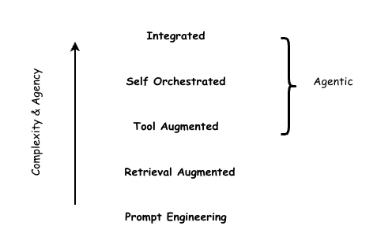

# AI Enablement Framework

## Introduction

===  "Preface"

    Artificial intelligence (AI) represents a material technological capability with significant implications for enterprise operations, risk posture, and societal impact. While AI lowers barriers to innovation and enables scalable solutions across business functions and customer segments, it simultaneously introduces a distinct and evolving set of risks. 

    In this rapidly changing technology landscape, the single most important factor for success is building safe, reliable, and trustworthy AI and Agentic solutions. At the same time it is often the most underrated aspect and often overlooked in the noise. We are here to help you navigate this complexity with clarity and confidence.

    ??? trustably  "Opinion"

        As AI-enabled and AI-augmented systems become easier to develop and deploy, the complexity of ensuring their reliability, safety, and trustworthiness increases correspondingly, requiring deliberate governance and oversight.

    Contemporary AI solutions are increasingly underpinned by generative AI (GenAI) technologies, including large language models (LLMs). These models are inherently non-deterministic, producing probabilistic outputs rather than predictable, repeatable results. Traditional software engineering, risk management, and control frameworks, however, are primarily designed around deterministic system behavior. As a result, existing standards, assurance practices, and control mechanisms are often insufficient to fully address the risk characteristics introduced by AI systems. This creates a material gap between established technology risk management approaches and the emerging risk profile associated with AI adoption.

    { width="1000" }

    AI-related risks are not confined to individual systems or use cases. They arise across system interactions, including integrations between AI and traditional applications, interactions among multiple AI systems, and human–AI decision-making processes. In addition, the increasing adoption of agent-based AI architectures—where systems are granted varying degrees of autonomy to initiate actions—introduces new dimensions of operational, ethical, and compliance risk. The emergence of multi-agent ecosystems further compounds these challenges by increasing system interdependence, opacity, and potential for cascading failure modes.

    As AI systems scale in autonomy and complexity, enterprises must anticipate a corresponding amplification of both value and risk. Effective AI governance therefore requires extending existing enterprise risk management frameworks to address AI-specific risks, supported by clear accountability structures, robust controls, continuous monitoring, and lifecycle-based assurance. Without such measures, organizations may struggle to balance innovation objectives with regulatory compliance, operational resilience, and stakeholder trust.

    ??? trustably  "Opinion"

        Mapping AI system interactions with real world is a novel aspect - and it is for the first time human intelligence is facing the possibility of interacting with potentially similar or more competent systems. 

===  "Rationale of this document"
    ???+ trustably  "Acknoledgement"

        It is important to note the acknoledgement to all frameworks noted here and this document should be seen an extension and assimilation of them, rather than a competing one.  s

    The traditional software industry has been shaped by well-established standards, control frameworks, and best practices that govern system design, delivery, and risk management. A natural question, therefore, is whether these existing practices can be extended to address the risks introduced by generative AI (GenAI) systems. This extension-based approach underpins frameworks such as the [NIST AI Risk Management Framework](https://www.nist.gov/itl/ai-risk-management-framework) and [AWS Well Architected Review (WAR)](https://docs.aws.amazon.com/wellarchitected/latest/generative-ai-lens/generative-ai-lens.html), among others. Both frameworks provide comprehensive, enterprise-grade risk management structures that have been adapted to incorporate AI- and GenAI-specific considerations.

    While these frameworks offer strong alignment with existing enterprise governance, risk, and compliance models, closer examination reveals that some foundational and novel risk characteristics of GenAI systems are insufficiently articulated when treated as incremental extensions of traditional software risk. In particular, aspects such as non-deterministic behavior, emergent system properties, model dependency risks, and human–AI interaction dynamics can be diluted within generalized control taxonomies. The objective of this document is therefore to synthesize these frameworks in a way that preserves a holistic, enterprise-wide perspective while explicitly addressing the unique risk requirements of GenAI-enabled systems.

    In addition, there are platform-specific frameworks, such as the [Databricks AI Security Framework (DASF) 2.0](https://www.databricks.com/resources/whitepaper/databricks-ai-security-framework-dasf), which focus on identifying and mitigating AI-related security risks through platform-native capabilities. While such frameworks are highly effective in articulating concrete technical controls and security patterns, they are inherently scoped to specific platforms and tend to be narrowly focused and deeply technical. As a result, they may be less accessible or actionable for broader governance, risk, and business stakeholders.

    Accordingly, this document also incorporates elements of DASF to strike an appropriate balance between technical rigor and enterprise-level risk governance. By integrating platform-level control insights with higher-level risk management frameworks, the document aims to support informed decision-making across both technical and non-technical audiences, while maintaining alignment with business objectives, regulatory expectations, and risk appetite.

## Enablement Framework

=== "Intended Audience"

    This framework is designed to be used by a wide range of personas according to scope of their typical responsibilities. 

    - Executive Leaders can use AEF as a guide to infuse AI in their organisation to drive technical and cultural maturity
    - Governance leaders can use AEF as an equivalent of risk-graded operational manual to roll out AI with right level of controls 
    - Product and Portfolio managers can use AEF as a broad picture of all required components of a successful AI rollout to make sure right level of collaboration and dependency management 
    - Practitioners can use AEF as a detailed guide to ensure AI system is built, configured, operated and managed in right way. 

    [Personas](personas.md){ .md-button .md-button--primary}

=== "Intended Use"

    AI enablement framework (This document) is aimed to produce single framework for practiotioners, leaders and other actors of any AI system. This document is intented to use for following broad purposes, while not limiting to any other valid scenarios. 

    ??? trustably  "Strategy and Conceptualisation"

        This framework can be used to illustrate requirements for a specific AI system implementation. It will help to understand how to prioritise certain aspects of the system and corresponding residual risks accrued - and conciously plan accordingly. 

    ??? trustably  "Design and Decide"

        This framework is intented for architects and solution designers to understand the wide impacts of the solution components - and should help to choose specific platform based on capbilities and prioritised requirements. 

    ??? trustably  "Risk Assessment and Improvements"

        This framework can be utilised to assess existing design and implementation of specific AI use case and help to improve risk and security postures by implementing best practice actions. 

        [Learn More](risk_actions.md){ .md-button .md-button--primary}

    ??? trustably  "AI Maturty Model Uplift"

        This framework can be utilised by AI leaders to align the organisation with a clear, comprehensive, industry-standard maturity model for AI system and platfor and guide them through using a well callibrated roadmap across four stages:

        - Explore: The organization is assessing the relevance and potential value of AI across priority business domains. AI initiatives are exploratory, use-case driven, and typically delivered disjointly. 
        - Experiment: The organization is actively piloting AI solutions through structured experiments and controlled deployments. Early AI platform components emerge, supported by initial standards for data access, model development, and security. 
        - Enable: The organization establishes a standardized AI platform and operating model to support consistent and repeatable AI delivery. 
        - Embrace: AI capabilities are fully integrated into the enterprise’s core platforms, decision processes, and operating model. 
        
        This maturity model is consistent with industry-known AI maturity models such as [AWS Prescriptive Guidance Model](https://docs.aws.amazon.com/prescriptive-guidance/latest/strategy-gen-ai-maturity-model/introduction.html), [MIT Sloan Model](https://cisr.mit.edu/publication/2024_1201_EnterpriseAIMaturityModel_WeillWoernerSebastian) or similar. Trustably framework is designed to seamlessly work with such models. 

## Components & Relationships

This section describes all components of AEF. It is important to note that these compoents influence each other in subtle but significant ways - ie actions taken to address issues in one components can impact other compoennts - potentially both positive and negative ways. The relationships are described here, however the actual impacts are subjected to specific constraints and situations under which this framework is adopted. 

{ width="1000" }

=== "Traits"

    AI system traits describe a comprehensive list of key requirements which must be pursuaded and achieved as much as possible. 

    [Learn More](trait.md){ .md-button  .md-button--primary}

=== "Focus Areas"

    Focus areas are the aspects of AI systems that should be influenced to address potential issues and challenges. 

    [Learn More](focus_areas.md){ .md-button .md-button--primary}

=== "System Lifecycle "

    Like any other software solution, AI systems follow a design, development, deployment and enhance lifecycle spanning across data, model and automation realms. This unique and wider scope requires to combine best practices of DataOps, ModelOps and DevSecOps for a successful roll out of a trustworthy and valuable AI system. 

    [Learn More](lifecycle.md){ .md-button .md-button--primary}

=== "Personas" 

    As noted in the preface, AI systems interacts with each other, with traditional systems and with humans - spanning the scope of actors to consider for a complex agentic AI system to a very wide set of personas. These scope can then be further divided into core actors, adjacent personas and external personas depending on their involvement in design, development and utilise such system

    [Learn More](personas.md){ .md-button .md-button--primary}

=== "Best Practices"

    A list of best practices across various components are curated for adoption. This is also presented via a playbook for easy navigation and discovering relationships between individual actions. 

    [Learn More](risk_actions.md){ .md-button .md-button--primary}

    

## More details

=== "Limitations" 

    This framework deliberately limits in certain areas, namely but not limited to:

    - **Inherent Advarserial Attacks:** The adversarial attacks are evolving as the LLMs are getting traction. This framework does not address such attacks because they are inherent to model arcitecture and generally out of scope for model consumers

    - **Inherent AI Safety issues: **For same reasons, inherent AI safety issues such as Goal misalignment if not addressed by this framework

    - **Cloud Platform:** This framework does not address any cloud platform issues explicitly, and delegates such issues to appropriate security and/or architecture best practices. It is strongly suggested that this framework should be used along with other appropriate best practices. 

    - **Data Platform:** While this framework provides a significant overlap with data platform capabilities and thus covers  largel part of data operations, this framework does not explicitly address underlying data platform design aspects such as data modelling, data processing, data storage etc. It is strongly suggested that this framework should be used along with other appropriate best practices. 

=== "Definitions" 

    ??? trustably  "Expand"

        `TBD`

=== "Acknowledgement"  

    ??? trustably  "Acknowledgement"

        This work draws on ideas, models, and concepts from existing research and industry sources. These materials have helped shape the thinking and structure of the approach presented here, while any adaptations or interpretations are our own. All sources are used with respect for their original intent and applicable attribution standards.

        Similarly, we would like to be acknowledged in case this work is used or inspired other work. 

