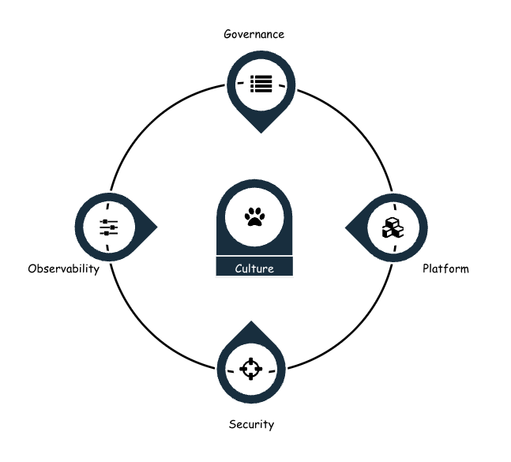

# Focus Areas

AI Enablement Framework organises risks, best practices and maturity models across `5` core focus areas - such as **Security**, **Observability**, **Platform**, **Governance** and **Culture**. Each of these high level focus areas are broken down to subsequent groups which provides clarity and targeted activities for organisations to adopt. 

{ align = left}

### Culture

??? trustably  "Active Awareness"

    TBD

??? trustably  "Purpose"

    TBD

??? trustably  "Roles & Responsibility"

    TBD

### Governance

??? trustably  "AI Risk Management"

    TBD

??? trustably  "Artefact Inventory"

    TBD

??? trustably  "Change Management"

    TBD

??? trustably  "Standards and Policies"

    TBD

### Observability

??? trustably  "Define and Instrument"

    TBD

??? trustably  "Evaluate and Measure"

    TBD

??? trustably  "Monitor and Action"

    TBD
    
### Security

??? trustably  "Access Control"

    TBD

??? trustably  "Data Classification and Controls"

    TBD

??? trustably  "Guardrails"

    TBD

### Platform

??? trustably  "Automation"

    TBD

??? trustably  "Integration and Collaboration "

    TBD

??? trustably  "MResiliencen"

    TBD

    

