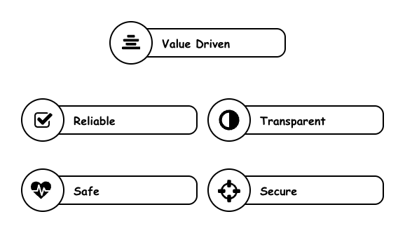

# Traits of AI Systems

## Vision of AI Systems

Develop an AI system which should be **Trustworthy** and **Desirable** 

{ width="600" }

## Value-Driven Traits

??? trustably  "Strategic"

    The application in discussion must be aligned with strategic objective of the organisation. This trait is critical to guide the prioritisation among many possible ideas and opportunities. 

??? trustably  "Desirable"

    A desirable AI system must be addressing real customer demands or solving real business problems. The value can be realised over multiple iterations of concrete well-defined product roadmap. 
    
??? trustably  "Viable"

    An operationally efficient AI system must have specific controls in place to optimise and enhance cost and system performance to keep the AI system viable 

## Trustworthiness Traits

??? trustably  "Reliable"

    A reliable AI system aspires to perform the tasks as correctly as possible such that it can fulfil business outcomes in an accepted level and able to withstand failures gracefully so that it is aligned with operational controls. Key aspect of reliability is an ability to instrument systems to trace, measure and improve right metrics over a period of time. 

    ??? quote inline  "Valid"
        The minimum requirement of any sestem must be that such systems should be able to behave as expected - at least in the context of their intented use. As the modern agentic AI ecosystem introduces a large amount of non-deterministic behaviour, it is even more important to introduce acceptable measures to evaluate the validity of such systems. 

    ??? quote inline  "Observable"
        Observability is a key element of modern DataOps, MLOps and DevOps - it allows to establish traceability, reproducibility, and continuous improvement in agentic workflows by providing a systemtic approach to maintain artefacts and measuring quality throughout the application lifecycle

    ??? quote inline "Resilient"
        Resilliancy is a distinct component which allows AI systems to function normally or degrade gracefully in the face of unexpected - even advarserial - change in the environment they are functioning 

??? trustably  "Safe"

    AI safety is defined - atleast in the context of this framework - as a trait which ensures the AI system does not neagatively impact the environment it is operating in. Safety is often describes a set of risks which, if realised, can have catastrophic outcome, and thus must be managed throughout the design, development, deployment and post-deployment lifecycle

    ??? quote inline "Unbiased, Un-Harmful"
        One of the known vulnerability of modern AI models is the bias they pick up during training process. There are many examples where Ai systems exhibits harmful properties even in a non-advarserial settings. It is thus critical to employ a range of guardrails to ensure such behaviour can be continously monitored and acted upon as needed. 

    ??? quote inline "Explainable"
        Explainable AI systems must provide a representation of inner working of how a particular outcome is arrived. An ancilliary concept is interpretability which is defined by the role of the outcome in context of the task itself. Explainibility and Interpretability enhances the understanding of how the system is performing - leading to higher safety settings. 

??? trustably  "Transparent"

    Transparency is a cornerstone of trustworthyness in a system. The scope of this trait expands throughout the lifecycle - right from design decisions,  data used for training, efficacy of any models used for any specific use case to all the way up to deployment practices, post-deployment monitoring and operating models including model-human interactions. 

    ??? quote inline "Accountable"
        Accountability clarifies who is responsible for intended use cases, design decisions, technical decisions, how and when an AI system is deployed and what end user decisions were made post-deployment - this provides a clarity around roles and responsibilities across the organisation to promote right focus and collaboration

    ??? quote inline "Interoperable"
        Hardly any reasonable moderm agentic AI solution is single sourced - and that necessiates the solution needs to embracy interoperability as a core principle. This helps to create modular and reusable components with clear integration points
        
??? trustably  "Secure"

    Security is a fundamental, non-negotiable requirement in any system - espcially AI systems. It is a core trustworthy feature for all types of AI systems - with varying degree of risk profiles across foundational models which uses prompts only, RAG systems which requires enterprise information and autonomous and compound agentic systems which require significant agency on data. 

    ??? quote inline "Context-Aware"
        Traditional information security and authorization models are predicated on three primary control dimensions: the identity of the requesting principal, the resource being accessed, and the action being performed. Existing authorization paradigms and access control mechanisms are largely designed around these dimensions. However, AI systems—particularly agentic architectures—introduce broader autonomy and decision-making capabilities that require an additional, context-aware control dimension. Specifically, authorization decisions must also incorporate the purpose and intent behind an agent’s action, enabling governance frameworks to assess __why__ an action is being performed in order to manage risk associated with expanded agency and non-deterministic behavior.

    ??? quote inline "Integrated"
        AI systems are inherently distributed across implementation, hosting, functional, and operational domains. This distributed architecture necessitates the establishment of an integrated and centrally governed security framework. Each component of the agentic ecosystem must be secured in accordance with its specific risk profile and operating characteristics, while ensuring alignment with enterprise-wide security standards and a cohesive, end-to-end security posture.

     